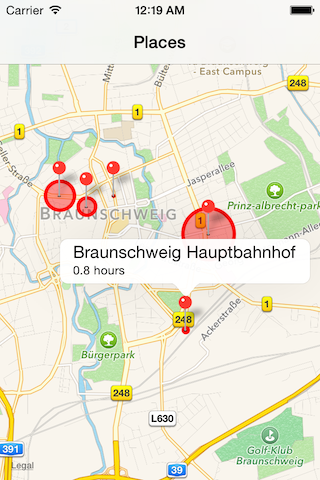

# Places

Places uses the [Moves][1] API to visualize which places you spent the most
time at in the last seven days.

It runs on iOS 7 only and you need to obtain OAuth credentials from
[Moves][2] to use it.

## Screenshots

---

Created by Boris Bügling (<boris@buegling.com>)

[1]: http://www.moves-app.com
[2]: https://dev.moves-app.com/login

